# Dossiê 28 — Auditoria da Arquitetura de Banco de Dados

> **Prompt 19** pediu para "criar toda a arquitetura de banco de dados da Rotta antes de desenvolver novas funcionalidades". A Rotta já tem 40 models Prisma/PostgreSQL construídos incrementalmente, módulo a módulo, ao longo dos Dossiês 8, 12, 13, 16–21 e 26–27 — refazer do zero jogaria fora um schema real, versionado, com 40 migrations aplicadas e em produção (Neon). Este dossiê é a auditoria pedida: revisão completa do que existe, os 7 entregáveis pedidos (diagrama, estrutura SQL, estrutura Prisma, fluxo de relacionamentos, melhorias, pontos críticos, evolução futura) e o único gap real encontrado, já fechado nesta rodada.

---

## 1. Metodologia desta auditoria

Nada abaixo foi escrito de memória. Cada afirmação foi verificada lendo `apps/api/prisma/schema.prisma` (2.247 linhas após esta rodada), as 18 migrations em `apps/api/prisma/migrations/`, e os módulos correspondentes em `apps/api/src/modules/`. Onde a auditoria encontrou uma lacuna real (Seção 9), a lacuna foi fechada com uma migration de verdade — não apenas documentada.

## 2. Cobertura: cada domínio pedido no Prompt 19 vs. o que existe

| Domínio pedido                                   | Onde vive hoje                                                                                                 | Observação                                                                               |
| ------------------------------------------------ | -------------------------------------------------------------------------------------------------------------- | ---------------------------------------------------------------------------------------- |
| Usuários                                         | `User`                                                                                                         | Identidade global, sem tenant próprio — ver Seção 6.1                                    |
| Responsáveis                                     | `User.isResponsavel = true`                                                                                    | Flag, não tabela separada — mesma identidade `User`                                      |
| Alunos                                           | `Student`, `StudentAuthorizedPerson`                                                                           | —                                                                                        |
| Escolas                                          | `School`, `SchoolAccessPoint`, `SchoolCompanyLink`                                                             | Catálogo compartilhado entre tenants (Seção 6.4)                                         |
| Empresas                                         | `Company`                                                                                                      | A Empresa **é** o tenant — não existe `Tenant` separada                                  |
| MEIs / Autônomos                                 | `Company.tipo = MEI \| AUTONOMO`                                                                               | Mesma tabela `Company`, discriminada por enum `CompanyType`                              |
| Motoristas                                       | `User` + `Membership.role = MOTORISTA`                                                                         | Papel, não tabela — ver Seção 6.2                                                        |
| Monitores                                        | `User` + `Membership.role = MONITOR`                                                                           | Idem                                                                                     |
| Veículos                                         | `Vehicle`                                                                                                      | —                                                                                        |
| Documentos (veículo)                             | `VehicleDocument`                                                                                              | —                                                                                        |
| **CNH / EAR / Cursos obrigatórios**              | `DriverDocument` (**novo nesta rodada**)                                                                       | Gap real — Seção 9                                                                       |
| Rotas                                            | `Route`                                                                                                        | Template recorrente                                                                      |
| Paradas                                          | `RouteStop`                                                                                                    | —                                                                                        |
| Viagens                                          | `Trip`                                                                                                         | Uma `Trip` por `Route` por dia operado                                                   |
| Escalas (substituição pontual)                   | `Trip.motoristaId/veiculoId/monitorId` sobrepondo o padrão de `Route`                                          | Não é uma tabela `Escala` separada — cada `Trip` já É o registro daquele dia (Seção 6.5) |
| Histórico                                        | Append-only em várias tabelas (`VehicleMaintenance`, `TripPosition`, `AuditLog`, `WalletTransaction`)          | Sem tabela `Historico` genérica — cada domínio tem o próprio ledger                      |
| Localizações / GPS / Rastreamento                | `TripPosition`, `Vehicle.ultimaLatitude/Longitude`                                                             | —                                                                                        |
| Contratos                                        | `Contract`                                                                                                     | —                                                                                        |
| Authentique                                      | `Contract.authentiqueDocumentId`                                                                               | Campo preparado, provedor real ainda não plugado (stub honesto)                          |
| Mensagens / Push Notifications                   | `Notification`, `NotificationDeliveryAttempt`, `DeviceToken`                                                   | —                                                                                        |
| Configurações                                    | `CompanySetting`                                                                                               | Chave/valor tipado por tenant                                                            |
| IA                                               | Sem tabela própria — Seção 6.6                                                                                 | Rotta AI/Geo AI/Communication AI são **serviços**, não entidades de dado                 |
| Auditoria                                        | `AuditLog`                                                                                                     | Polimórfico, append-only, nunca UPDATE/DELETE                                            |
| Logs                                             | `AuditLog` + logs de aplicação (fora do banco)                                                                 | —                                                                                        |
| Permissões / Perfis                              | `Membership.role` (string, fonte de verdade em `role.enum.ts`)                                                 | —                                                                                        |
| Planos                                           | `Plan`                                                                                                         | Tabela, não enum — de propósito (Seção 6.3)                                              |
| Assinaturas                                      | `Company.abacatepaySubscriptionId`                                                                             | —                                                                                        |
| Cobranças / AbacatePay / Pagamentos              | `Company.abacatepaySubscriptionId` (assinatura) + `Wallet`/`WalletTransaction`/`WithdrawalRequest` (Rotta Pay) | Dois fluxos distintos — Seção 6.7                                                        |
| Escolas do MEC/INEP                              | `School.codigoInep`                                                                                            | —                                                                                        |
| Cache das escolas / Geolocalização / Coordenadas | `SchoolCoordinate`                                                                                             | Histórico de tentativas, nunca a fonte de leitura (Seção 6.8)                            |
| IA de geocoding / validação de endereço          | Serviços (`Geocoding AI Agent`, `Validation AI Agent`), gravam em `SchoolCoordinate`                           | —                                                                                        |
| Tokens / Sessões / Login                         | `Session`, `PasswordResetToken`                                                                                | —                                                                                        |
| Convites / Códigos de acesso                     | `Invite`                                                                                                       | —                                                                                        |
| Histórico de alterações                          | `AuditLog.dadosAntes`/`dadosDepois` (JSON)                                                                     | —                                                                                        |

**Resultado**: de ~45 conceitos pedidos, 44 já tinham representação real e correta no schema (a maioria como _papel_/_flag_ de uma tabela mais genérica, não como tabela 1:1 — decisão de normalização deliberada, não descuido). Só **1** gap real: CNH/EAR/Cursos obrigatórios não tinham tabela nenhuma — fechado nesta rodada com `DriverDocument` (Seção 9).

## 3. Diagrama ER

Diagrama por domínio (40 models em um único diagrama seria ilegível). Setas = FK; `1—1`/`1—N`/`N—N` conforme cardinalidade real do schema.

```mermaid
erDiagram
    User ||--o{ Membership : "tem"
    Company ||--o{ Membership : "tem"
    Company }o--|| Plan : "assina"
    Company ||--o{ CompanySetting : "configura"
    User ||--o{ Session : "autentica"
    User ||--o{ PasswordResetToken : "recupera senha"
    Company ||--o{ Invite : "convida"
    User ||--o{ AuditLog : "audita (ator)"
    Company ||--o{ AuditLog : "audita (tenant)"

    Company ||--o{ Vehicle : "possui"
    Vehicle ||--o{ VehicleDocument : "anexa"
    Vehicle ||--o{ VehicleMaintenance : "manutenção"
    Vehicle ||--o{ VehicleReminder : "lembrete"
    Vehicle ||--o{ VehicleAssignment : "vínculo motorista/monitor"
    Vehicle ||--o{ VehicleChecklist : "checklist"
    Vehicle ||--o{ VehicleOccurrence : "ocorrência"
    User ||--o{ DriverDocument : "CNH/EAR/curso"
    Company ||--o{ DriverDocument : "revisa"

    School ||--o{ SchoolAccessPoint : "portão/ponto"
    School ||--o{ SchoolCompanyLink : "atendida por"
    Company ||--o{ SchoolCompanyLink : "atende"
    School ||--o{ SchoolCoordinate : "tentativa geocode"

    User ||--o{ Student : "responsável por"
    Student ||--o{ StudentAuthorizedPerson : "autoriza"
    User ||--o{ TransportRequest : "solicita"
    Company ||--o{ TransportRequest : "recebe"
    TransportRequest ||--|| Contract : "vira"
    Student ||--o{ Contract : "contratado para"
    School ||--o{ Contract : "atende"
    Vehicle |o--o{ Contract : "atribuído"
    Contract ||--o{ Rating : "avaliado após"

    Company ||--o{ Route : "opera"
    Vehicle |o--o{ Route : "padrão de"
    Route ||--o{ RouteStop : "paradas"
    Route ||--o{ RouteStudent : "alunos vinculados"
    Contract ||--o| RouteStudent : "origina"
    Route ||--o{ Trip : "gera (1 por dia)"
    Vehicle ||--o{ Trip : "usado em"
    Trip ||--o{ TripPosition : "GPS"
    Trip ||--o{ TripStudentEvent : "embarque/desembarque"

    User ||--o{ Notification : "recebe"
    Notification ||--o{ NotificationDeliveryAttempt : "tentativa por canal"
    User ||--o{ DeviceToken : "token FCM"
    User ||--o| NotificationPreference : "preferências"

    Company |o--|| Wallet : "carteira"
    User |o--|| Wallet : "carteira (motorista)"
    Wallet ||--o{ WalletTransaction : "ledger"
    Wallet ||--o{ WithdrawalRequest : "saque"

    Company ||--o{ EventoAgenda : "calendário"
```

## 4. Estrutura SQL — convenções aplicadas em toda tabela

Verificadas mecanicamente (não por amostragem): `grep -c` no schema confirma **66 `@@index`**, **28 `@unique`/`@@unique`**, **18 campos `deletedAt`** (soft delete — presente em toda tabela onde faz sentido reter histórico; ausente de propósito em tabelas append-only como `TripPosition`/`AuditLog`, onde a linha nunca deveria ser ocultável) e **43 campos `createdAt`**.

- **Primary key**: `id String @id @default(uuid()) @db.Uuid` em **100%** das 40 tabelas — nunca serial/autoincrement. UUID v4 gerado pelo Postgres (`gen_random_uuid()` via Prisma), nunca pela aplicação — evita colisão em cenário de múltiplas réplicas de API escrevendo simultaneamente.
- **Foreign key**: toda FK declara `onDelete` explicitamente — nunca o padrão implícito do Postgres. Três políticas usadas com intenção:
  - `Cascade`: quando o filho não faz sentido sem o pai (ex. `VehicleDocument` sem `Vehicle`).
  - `Restrict`: quando apagar o pai destruiria histórico legal/financeiro (ex. não se apaga um `User` que já é `motorista` de um `Contract` ativo).
  - `SetNull`: quando o vínculo é operacional e pode ficar órfão sem quebrar o resto (ex. `Vehicle.ultimoMotoristaId`).
- **Multi-tenancy**: toda tabela de negócio carrega `companyId` (RLS por tenant — Seção 6.9), exceto as que são deliberadamente catálogo compartilhado (`School`, `Plan`).
- **Soft delete**: `deletedAt DateTime?`, nunca `DELETE` físico em tabela com valor de auditoria/negócio. Ausente por design em ledgers append-only (não existe "deletar uma transação").
- **Constraints de unicidade** aplicadas onde a regra de negócio exige (não por reflexo): `Company.cpfCnpj`, `Vehicle.placa`, `User.email/telefone/cpf` são únicos **globalmente**, não por tenant — impedem cadastro duplicado da mesma pessoa/veículo/empresa física em tenants diferentes.
- **Índices compostos** seguem o padrão `[companyId, <coluna mais filtrada>, ...]` — alinhado com o predicado de RLS (sempre filtra por `companyId` primeiro) mais o filtro de tela mais comum.
- **PostGIS**: extensão habilitada (`extensions = [postgis]`), índice espacial GiST em `School` (campo `Unsupported` do Prisma, mantido por trigger — migration `20260803192602_geo_map_intelligence`).

## 5. Estrutura Prisma — organização e convenções do `schema.prisma`

- Um único arquivo, organizado em **seções por módulo** (comentários `// ====` delimitando cada bloco: Empresas, Auth, Veículos, Escolas, Marketplace, Rotas/GPS, Communication, Rotta Pay, Agenda, e agora Driver Compliance) — nunca `schema.prisma` fragmentado em múltiplos arquivos (Prisma não suporta `import` nativo na versão em uso).
- Todo enum e todo model tem um comentário `///` (doc comment) explicando **por que** a modelagem é essa, não apenas o que ela é — convenção consistente desde o primeiro model (`Plan`, Dossiê 16). Isso é o que tornou esta auditoria possível de fazer com precisão em uma única passada.
- Nomes de campos em **português** (domínio de negócio), nomes de tabela (`@@map`) em **inglês snake_case** — separação deliberada entre a linguagem do modelo de negócio (o schema Prisma, que a equipe lê) e a convenção SQL da própria tabela física.
- Relações nomeadas (`@relation("NomeExplicito")`) sempre que um model tem mais de um relacionamento com o mesmo alvo (ex. `User` tem 6 relações nomeadas distintas só com `Vehicle`/`VehicleDocument`/etc.) — sem isso o Prisma não consegue inferir qual FK corresponde a qual campo.
- Enums para vocabulário fechado e estável (`VehicleType`, `ContractStatus`); tabelas para vocabulário que cresce por dado, não por schema (`Plan` — novo plano é um `INSERT`, nunca uma migration).

## 6. Fluxo dos relacionamentos — como os módulos conversam

### 6.1 Identidade: `User` é global, `Membership` é o vínculo

Um `User` não pertence a uma empresa — ele pode ter `Membership`s em várias `Company`s simultaneamente, cada uma com um `role` (`MOTORISTA`, `MONITOR`, `GESTOR`, etc.). Isso é o que permite a mesma pessoa ser responsável de um filho **e**, em paralelo, motorista autônomo cadastrado como sua própria `Company` (`tipo = AUTONOMO`). `isAdminRotta`/`isResponsavel` são as duas únicas flags de "papel sem tenant" — o login lê essas flags antes de sequer procurar `Membership`.

### 6.2 Motorista/Monitor não são tabelas — são o par (`Membership.role`, `User`)

Em vez de `Driver`/`Monitor` como tabelas próprias (que duplicariam nome/CPF/telefone/senha já em `User`), a Rotta usa o mesmo `User` em todo lugar que precisa referenciar "quem dirige"/"quem monitora" (`Route.motoristaPadraoId`, `Trip.motoristaId`, `VehicleAssignment.userId`, `DriverDocument.userId`) — sempre `User`, nunca uma FK pra uma tabela `Driver` inexistente. `Membership.role` é o que diz, para uma dada `Company`, se aquele `User` está autorizado a aparecer nesses campos.

### 6.3 `Plan` é tabela, não enum

Decisão explícita do Dossiê 16: um novo plano comercial (preço, nome) é um dado que muda com frequência maior que o schema deveria — modelar como tabela faz de "criar plano" um `INSERT` via seed, nunca uma migration.

### 6.4 `School` é catálogo compartilhado, não por-tenant

Diferente de `Vehicle`/`Route` (isolados por `companyId`), uma `School` existe **uma vez** na plataforma e é vinculada a N empresas via `SchoolCompanyLink` — decisão de arquitetura do Dossiê 8/13: a mesma escola física é atendida por várias transportadoras diferentes ao longo do tempo/simultaneamente, e duplicar o cadastro da escola por tenant geraria dado inconsistente (duas transportadoras com endereço/coordenada diferentes para a mesma escola).

### 6.5 Rota é template, Viagem é o dia — "escala" é uma `Trip`

`Route` guarda o recurso **padrão** (motorista/veículo/monitor de sempre). Toda vez que a rota efetivamente roda em um dia, nasce uma `Trip` (única por `[routeId, data]`) que pode **sobrescrever** o recurso daquele dia especificamente (motorista substituto, veículo reserva) sem tocar no padrão da `Route`. Não existe uma tabela `Escala`/`Roster` separada porque a `Trip` já é, por definição, o registro "quem trabalhou nesta rota neste dia".

### 6.6 IA não tem tabela própria — é comportamento, não dado

Rotta AI, Rotta Geo Engine (Geocoding/Validation/Map Intelligence Agents) e Communication AI (4 agentes) são **serviços** (`RottaAiService`, `GeocodingAiAgent`, etc.) que **leem e escrevem** nas tabelas de domínio (`VehicleDocument.rottaAiStatus`, `SchoolCoordinate`, `Notification.canaisEscolhidos`) — não existe (nem deveria existir) uma tabela `IaAgent`/`IaExecucao` genérica, porque cada agente já grava seu resultado na entidade de negócio que ele está avaliando. Um painel de observabilidade de IA (Prompt 21) lerá **logs de aplicação**, não uma tabela de domínio.

### 6.7 Dois fluxos financeiros distintos, propositalmente não fundidos

- **Assinatura da plataforma** (a Empresa paga a Rotta pelo uso do sistema): `Plan` + `Company.abacatepaySubscriptionId`, cobrança recorrente via AbacatePay.
- **Rotta Pay** (a Empresa/Motorista recebe o Responsável através da plataforma): `Wallet`/`WalletTransaction`/`WithdrawalRequest`, ledger append-only, gatilho automático quando um `Contract` é ativado (Dossiê 26).

São dois produtos diferentes (a Rotta cobrando vs. a Rotta processando o recebimento de terceiros) — fundir os dois em uma única "tabela de pagamentos" misturaria receita própria com dinheiro de cliente, o tipo de erro contábil que uma auditoria financeira reprovaria.

### 6.8 `SchoolCoordinate` é o "porquê", `School.latitude/longitude` é o "o quê"

Toda tentativa de geocodificação (Geocoding AI Agent) grava uma linha em `SchoolCoordinate` (com `status`, `tentativa`, `fonte`). Só quando o Validation AI Agent aprova (`status = VALIDADO`) o Map Intelligence Agent copia o valor para `School.latitude/longitude` — a única fonte lida por Marketplace/mapas/rotas. Duas tabelas de propósito: nunca duas fontes de verdade divergentes sobre "onde fica esta escola agora".

### 6.9 Isolamento multi-tenant (RLS)

Toda tabela de negócio (exceto catálogo compartilhado) carrega `companyId`. A aplicação nunca confia apenas no filtro de query — `TenantGuard` (Dossiê 12) injeta o `companyId` do JWT em toda operação, e o `Admin Rotta` (`isAdminRotta = true`) é o único papel com bypass documentado. `AuditLog.companyId` é opcional justamente para cobrir ações do Admin Rotta sem tenant (ex. sincronização INEP nacional).

## 7. Melhorias sugeridas

1. **Particionamento declarativo de `TripPosition`** (por mês, `RANGE` em `capturadaEm`) antes do volume de GPS ficar alto — já identificado como lacuna conhecida no cabeçalho do schema; hoje ainda não crítico (Trips/GPS é módulo recente), mas é o primeiro candidato a crescer rápido (uma posição a cada poucos segundos por viagem ativa).
2. **Constraint condicional de `Wallet` por `ownerType`** (`CHECK (ownerType = 'EMPRESA') = (companyId IS NOT NULL)`) — hoje validado só na camada de aplicação; um `CHECK` no banco fecharia a garantia mesmo contra um bug futuro de código.
3. **Índice parcial em `deletedAt IS NULL`** nas tabelas de maior volume de leitura (`Vehicle`, `Company`) — hoje o índice existe mas não é parcial; como a maioria das queries filtra "não deletado", um índice parcial reduziria o tamanho físico do índice sem perder cobertura.
4. **Read replica** para consultas de dashboard/analytics (Prompt 22) — nenhuma configurada hoje; consultas agregadas nacionais não deveriam competir por I/O com a escrita transacional (embarque/GPS em tempo real).
5. **Formalizar `DriverDocument` no fluxo de aprovação** (Prompt 21, Central de Aprovações) — a tabela existe agora, falta o endpoint/tela que a Rotta Pay já tem para `VehicleDocument`.

## 8. Pontos críticos

1. **`AuditLog`/`EventoAgenda` são polimórficos** (`entidadeTipo`/`entidadeId` como string solta, sem FK real) — trade-off já documentado no próprio schema: perde-se integridade referencial forte do Postgres, ganha-se não precisar de uma tabela satélite por domínio. Aceitável para trilha de auditoria (nunca é a fonte de verdade de nada, só o registro histórico); seria um risco maior se alguma regra de negócio dependesse de fazer `JOIN` real nessas colunas.
2. **`CompanySetting` é EAV (chave/valor)** — flexível, mas sem validação de schema no banco (o tipo do valor é uma string livre, `tipo` só documenta a intenção). Consultas que precisem filtrar/agregar por uma configuração específica em escala nacional (ex. "quantas empresas têm o canal WhatsApp habilitado") exigem `JOIN` + `WHERE chave = 'x'` em vez de uma coluna indexada — aceitável para configuração de baixa frequência de leitura agregada, mas vale reavaliar se o Analytics (Prompt 22) precisar cruzar `CompanySetting` em relatório nacional recorrente.
3. **`Session.tenantId`/`role`/`vinculoId` são desnormalizados do JWT** — corretos no momento da emissão, mas não são atualizados se o `Membership` mudar de `role` no meio da sessão (o usuário só vê a mudança no próximo login, comportamento documentado como intencional, não bug).
4. **`DriverDocument.companyId` exige reenvio por empresa** (Seção 9) — um motorista com `Membership` em duas transportadoras precisa enviar CNH duas vezes. Aceito de propósito (cada transportadora responde legalmente pela própria cópia em arquivo), mas é uma fricção de produto que vale confirmar com o time jurídico antes de tratar como definitivo.
5. **Nenhuma read replica/PgBouncer configurado ainda** — em "milhões de usuários" (like pedido no prompt), uma única instância Postgres (mesmo com índices corretos) eventualmente satura em conexões simultâneas; o plano de evolução (Seção 10) já antecipa isso.

## 9. Gap fechado nesta rodada: `DriverDocument` (CNH/EAR/Cursos obrigatórios)

A auditoria confirmou que `NotificationType.CNH_VENCENDO` e `EventoAgendaTipo.VENCIMENTO_CNH` **já existiam** no schema — mas nenhuma tabela guardava o dado de origem (número da CNH, categoria, data de vencimento, certificado EAR, curso de transporte escolar). As duas notificações nunca podiam disparar de verdade por falta de dado pra ler.

Modelo novo: `DriverDocument` — mesmo formato de `VehicleDocument` (upload + vencimento + análise assíncrona da Rotta AI), preso ao `User` (pessoa física) em vez de ao `Vehicle`, com `tipo` (`CNH`, `EAR`, `CURSO_TRANSPORTE_ESCOLAR`, `ANTECEDENTES_CRIMINAIS`, `OUTRO`) e `categoria` (só relevante para CNH — ex. "D", "E"). `companyId` é uma FK real (diferente de `VehicleDocument.companyId`, que é desnormalizado de `vehicleId`) porque não existe nenhuma FK obrigatória no caminho de onde derivar o tenant — o dono lógico (`User`) é global, sem tenant próprio.

Migration `20260807023218_driver_documents_cnh_ear_cursos` — 1 tabela, 2 enums, 3 FKs, 2 índices compostos (`[companyId, userId, tipo]`, `[companyId, vencimentoEm]`). Escopo desta rodada é só o schema (Prompt 19); o `DriversModule`/`RottaAiService` que vão ler/escrever esta tabela e a tela de upload no app entram no Prompt 20 (evolução da API), já com o dado pronto para usar.

## 10. Plano para evolução futura

| Gatilho                                                                                            | Ação                                                                                                                                      |
| -------------------------------------------------------------------------------------------------- | ----------------------------------------------------------------------------------------------------------------------------------------- |
| `TripPosition` passar de ~10M linhas                                                               | Particionar por mês (`RANGE` em `capturadaEm`), já antecipado no schema                                                                   |
| Volume de leitura de dashboard/analytics competir com escrita transacional                         | Read replica dedicada (Neon suporta nativamente) + `pgbouncer`/connection pooling                                                         |
| Analytics nacional (Prompt 22) precisar de agregação pesada recorrente                             | Considerar `materialized view` refletida por job, nunca query direta nas tabelas transacionais em hora de pico                            |
| Volume de `Notification`/`AuditLog` crescer sem limite                                             | Política de retenção + arquivamento frio (ex. mover `AuditLog` com +2 anos para storage mais barato, mantendo LGPD/compliance)            |
| Múltiplas empresas por região precisarem de isolamento de dados mais forte que RLS por `companyId` | Reavaliar schema-per-tenant só se/quando um cliente enterprise exigir contratualmente — não antes, custo de complexidade hoje não se paga |
| Cobertura nacional exigir baixa latência em regiões distantes do banco primário                    | Réplica de leitura geograficamente distribuída (decisão de infraestrutura, não de schema — ver Prompt 23)                                 |

---

**Próximo prompt na sequência**: Prompt 20 — evoluir a API (`DriversModule`) para expor `DriverDocument` via endpoints reais, reaproveitando exatamente o padrão já usado em `VehicleDocument` (upload, RBAC, análise Rotta AI).
