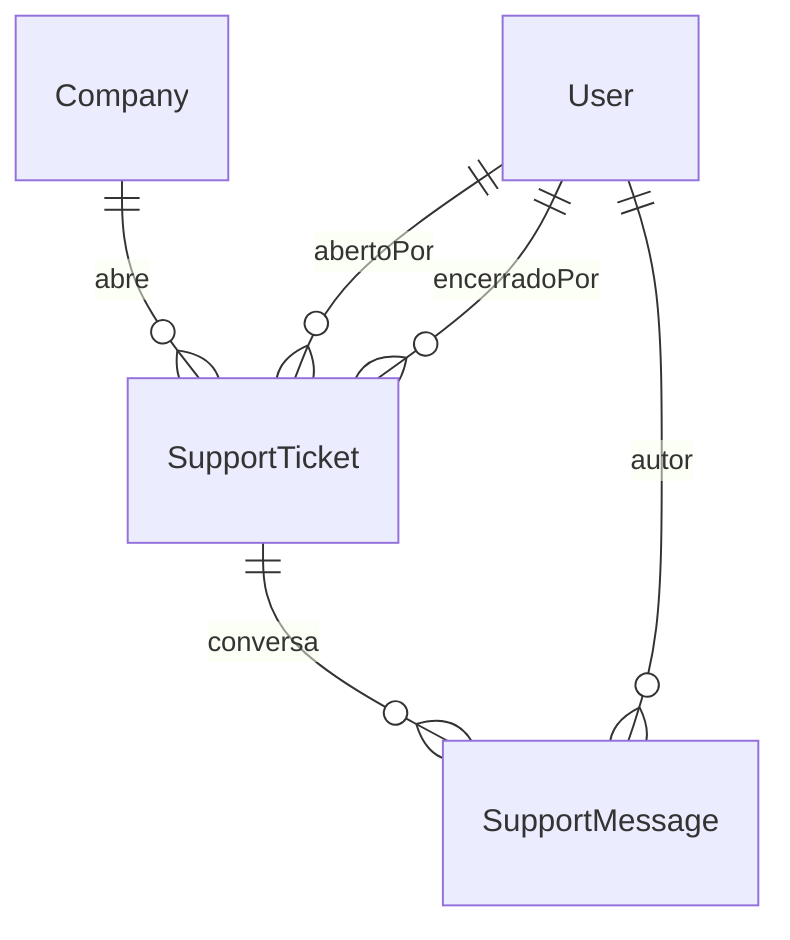

# Dossiê 29 — Backoffice da Rotta (Painel Administrativo)

> Prompt 21 da sequência de evolução da plataforma. Segue o mesmo método do
> Dossiê 28: diagnóstico real (o que existe hoje, com evidência) antes de
> qualquer implementação, e implementação apenas do que estava genuinamente
> faltando — nunca reconstrução do que já funciona.

## 1. Metodologia

Auditoria direta do código (não de intenção/planejamento):

- `apps/admin/src` — todas as rotas existentes, componentes, hooks.
- `apps/api/src/modules/{support,dashboard,logs,analytics,companies,audit}` —
  estado real de cada módulo (`grep` por "ESTADO ATUAL: modulo vazio").
- `docs/11-...md` §6 (Admin Rotta — painel interno) e `docs/20-...md`
  (`SUP-01` a `SUP-03`, `ADM-01` a `ADM-06`) — a especificação funcional já
  escrita para este exato escopo, nunca reescrita aqui, só implementada.
- `apps/api/prisma/schema.prisma` — confirmação de que `RN-10` (Dossiê 8) já
  tinha o mecanismo de bypass de RLS do Admin Rotta pronto (`TenantGuard`),
  só faltava o endpoint que o _usa com auditoria obrigatória_.

## 2. Diagnóstico — o que já existia

| Item pedido (briefing)                                      | Estado antes desta entrega                                                                                                                                                                                                                                                                                                               |
| ----------------------------------------------------------- | ---------------------------------------------------------------------------------------------------------------------------------------------------------------------------------------------------------------------------------------------------------------------------------------------------------------------------------------- |
| RBAC interno (Super Admin/Operações/Suporte/Financeiro/...) | **Não existe.** Um único papel `Role.ADMIN_ROTTA` (`User.isAdminRotta`), sem sub-papéis. Ver §6 — decisão de não implementar agora.                                                                                                                                                                                                      |
| Dashboard nacional                                          | **Não existia.** `apps/admin/src/app/(admin)/page.tsx` era um placeholder ("Painel interno — em construção"). `DashboardModule`/`AnalyticsModule`/`LogsModule` no backend seguem vazios (Dossiê 13 §15/§22, Dossiê 12 §10.3) — são os módulos certos para os itens de IA/métricas/logs técnicos, fora do escopo desta entrega (ver §10). |
| Central de Aprovações                                       | **Não existia como tela**, mas os _dados_ já existiam: `DriverDocument.rottaAiStatus` (Dossiê 28), `VehicleDocument.rottaAiStatus`, `Contract.status = AGUARDANDO_ASSINATURA`. Faltava só a camada de agregação/leitura.                                                                                                                 |
| Central de Atendimento (tickets)                            | **Não existia nada** — nem schema, nem `SupportModule` (só o stub `@Module({})`), nem UI. Especificação completa já existia em `docs/20-...md` (`SUP-01` a `SUP-03`, `ADM-04`) — implementada literalmente aqui.                                                                                                                         |
| "Acessar como suporte" auditado (`ADM-01`, `RN-10`)         | Não existia. O bypass de RLS do Admin Rotta já existia (`TenantGuard`), mas nenhuma rota específica gerava o log de auditoria "com justificativa" exigido por `RN-10`.                                                                                                                                                                   |
| Painel IA/MEC-INEP/OSM/Financeiro                           | Não existem telas dedicadas. Dados parciais já existem espalhados (Dossiê 15 Rotta AI, módulo Geo/INEP, `AbacatePay`/Billing) — ver §10, fora do escopo desta fase.                                                                                                                                                                      |
| Gestão de usuários/sessões                                  | `UsersModule`/`Session` (Prisma) já existem para o próprio fluxo de auth; uma tela de administração cross-tenant de usuários não existe — ver §10.                                                                                                                                                                                       |
| Trilha de auditoria (viewer)                                | `AuditLog`/`AuditLogService` já existiam (Dossiê 8 §16) com escrita e leitura por empresa. Não havia consumidor no Backoffice — não implementado nesta fase (ver §10), mas o Backoffice agora é o segundo consumidor de escrita (`ADMIN_ACCESSED_AS_SUPPORT`).                                                                           |
| Notificações broadcast / marketing / 2FA                    | Não existem. Fora do escopo desta fase — ver §10.                                                                                                                                                                                                                                                                                        |

## 3. O que foi implementado nesta fase

### 3.1 Módulo Suporte (`apps/api/src/modules/support`) — `SUP-01` a `SUP-03`, `ADM-04`

Backend completo, do zero, seguindo literalmente a especificação já escrita
no Dossiê 20:

- **Prisma**: `SupportTicket` (assunto/descrição/categoria/status/anexo,
  `companyId` com RLS por tenant) e `SupportMessage` (mensagem/anexo,
  `autorIsAdminRotta` — snapshot de papel para render do balão de chat).
  Enums `SupportTicketCategoria` (DUVIDA/PROBLEMA_TECNICO/COBRANCA/OUTRO) e
  `SupportTicketStatus` (ABERTO/EM_ANDAMENTO/ENCERRADO).
- **Regras automáticas de status** (nunca ação manual separada, exatamente
  como `SUP-02` especifica):
  - Primeira resposta de um Admin Rotta em um ticket `ABERTO` →
    `EM_ANDAMENTO` (só indicador de UI).
  - Qualquer mensagem nova em um ticket `ENCERRADO` → reabre automaticamente
    (`SUP-02`: "não é possível conversar em um ticket fechado sem reabri-lo
    formalmente"), preservando o histórico — nunca cria um ticket novo.
- **RBAC**: `Role.EMPRESA`/`Role.GESTOR` abrem/veem/respondem/encerram
  chamados só do próprio tenant (nunca aceitam `companyId` do cliente);
  `Role.ADMIN_ROTTA` cross-tenant, com filtro opcional por empresa.
- **Auditoria**: toda ação do ciclo de vida do chamado
  (`SUPPORT_TICKET_OPENED`/`_REOPENED`/`_CLOSED`, `SUPPORT_MESSAGE_SENT`)
  gera um `AuditLog`, best-effort (mesmo padrão de `DriversService`).
- **Não implementado nesta fase**: notificação push/e-mail de nova resposta
  (`SUP-01`/`SUP-02` pedem "usuário é notificado") — exigiria um novo
  `NotificationEventType` no enum Prisma (nova migração), documentado como
  item do plano de evolução (§10) para não misturar duas migrações de
  escopos diferentes na mesma entrega.
- **Frontend**: `apps/web` ganhou `/chamados` (lista), `/chamados/novo`
  (abertura) e `/chamados/[id]` (chat) — a URL `/suporte` já era ocupada
  pela página pública de marketing (`(marketing)/suporte`), daí o nome
  distinto; `apps/admin` ganhou `/suporte` (fila cross-tenant) e
  `/suporte/[id]` (chat com contexto de `companyId`).

### 3.2 Módulo Backoffice (`apps/api/src/modules/backoffice`) — `ADM-01`

Novo módulo — não existia nenhum candidato natural nos módulos já
declarados (`DashboardModule` é explicitamente "tela inicial do
Gestor/Empresa", não do Admin Rotta; `AnalyticsModule`/`LogsModule` são os
donos corretos de IA/métricas técnicas, mas seguem vazios por decisão de
escopo, §10).

- **`GET /backoffice/dashboard`**: KPIs reais (nunca hardcoded em zero) —
  empresas por status, motoristas/monitores ativos, veículos, alunos,
  viagens hoje, chamados abertos, e as 3 categorias de aprovação pendente
  somadas. Todas as contagens são agregações cross-tenant via
  `this.prisma.withBypass(...)`, legítimo aqui porque todo o módulo é
  exclusivo de `Role.ADMIN_ROTTA` (`@Roles(Role.ADMIN_ROTTA)` no controller
  inteiro).
- **`GET /backoffice/approvals`**: uma primeira Central de Aprovações —
  agrega `DriverDocument`/`VehicleDocument` com `rottaAiStatus` PENDENTE ou
  REPROVADO e `Contract` com `status = AGUARDANDO_ASSINATURA`, com o nome
  da empresa/pessoa já resolvido (sem N+1 no frontend). Leitura apenas
  nesta fase — aprovar/reprovar em lote é item do plano de evolução (§10),
  porque cada categoria tem sua própria ação de aprovação já existente no
  módulo dono (ex. reprocessar Rotta AI é ação de `DriversService`/
  `VehiclesService`, não do Backoffice).
- **`POST /backoffice/companies/:id/access-as-support`** (`ADM-01`,
  `RN-10`): exige `motivo` (mínimo 10 caracteres), grava o `AuditLog`
  **antes** de retornar os dados da empresa, e — decisão deliberada — o
  registro de auditoria aqui é **estrito** (nunca best-effort como em todo
  o resto do código): se o log não puder ser gravado, o acesso é negado.
  A garantia de `RN-10` ("todo acesso do Admin Rotta a dado de um tenant
  gera log de auditoria imutável, inclusive leitura") é o próprio propósito
  deste endpoint, não um efeito colateral dele — coberto por teste
  (`accessAsSupport` propaga o erro do `AuditLogService.record`).
- **Frontend**: `apps/admin` `/` deixou de ser um placeholder e agora
  renderiza os KPIs reais com atalhos para `/suporte` e `/aprovacoes`;
  `/aprovacoes` lista as 3 categorias; o botão "Acessar como suporte" foi
  adicionado à ficha da empresa (`/empresas/:id`), com o mesmo texto de
  confirmação especificado em `ADM-01`.

### 3.3 Correção de gap: RLS ausente em `driver_documents`

Durante a auditoria (§1), a revisão da migração de `DriverDocument`
(Dossiê 28/Prompt 20) mostrou que a tabela foi criada **sem** a policy de
RLS por `companyId` que toda outra tabela de tenant tem (`vehicle_documents`,
`contracts`, etc.) — `PrismaDriverDocumentRepository` sempre chama
`withTenant(...)` presumindo essa policy. A camada de aplicação
(`DriversService.resolveCompanyContext` + checagem de `document.userId` em
`removeDocument`) evitava o acesso indevido na prática, mas a defesa em
profundidade da Dossiê 8 §15 não estava completa. Fechado nesta entrega com
uma migração dedicada (`20260807030412_driver_documents_rls_fix`) — nenhuma
mudança de schema, só a policy que faltava.

## 4. Novas tabelas (Prisma)

## 5. RBAC — decisão de não implementar sub-papéis internos agora

O briefing pede 10 papéis internos (Super Admin, Administrador, Operações,
Suporte, Financeiro, Comercial, Jurídico, Marketing, Desenvolvimento,
Auditoria). Hoje existe um único `Role.ADMIN_ROTTA`. Decisão: **não**
modelar isso nesta fase, por três razões concretas:

1. **Nenhuma tela/endpoint hoje distingue permissões dentro do Admin
   Rotta** — implementar os papéis sem nenhum consumidor real seria
   adicionar uma tabela/enum morto, contra a disciplina do Dossiê 23 de
   nunca construir infraestrutura sem uso imediato.
2. É uma mudança **transversal** (toca `Role` enum, `RolesGuard`, todo
   controller que hoje faz `@Roles(Role.ADMIN_ROTTA)`) — mesclar essa
   mudança estrutural com a entrega funcional deste Prompt (Suporte +
   Aprovações + Dashboard) tornaria o diff difícil de revisar e testar
   isoladamente.
3. Só faz sentido priorizar quando houver TELAS que precisem negar acesso
   dentro do próprio Admin Rotta (ex. Financeiro vendo dados de cobrança
   que Suporte não deveria ver) — isso ainda não existe (o painel
   Financeiro, ADM-03, também não foi construído nesta fase).

Registrado explicitamente como item do plano de evolução (§10) para não se
perder.

## 6. Testes

- `SupportService`: 12 testes (criação/RBAC/escopo por tenant/reabertura
  automática/transição de status/encerramento).
- `BackofficeService`: 4 testes (soma de KPIs, delegação da fila de
  aprovações, e — caso crítico — a garantia de que `accessAsSupport` nunca
  retorna dados se a auditoria falhar).
- Suite completa da API: **49 suítes / 465 testes, 100% passando**
  (46→49 suítes, 451→465 testes desde o fechamento do Prompt 20), sem
  nenhum teste pré-existente quebrado.

## 7. Pontos críticos

1. **Notificação de resposta de chamado não está ligada** (§3.1) — hoje o
   Gestor só sabe que o Admin Rotta respondeu ao recarregar `/chamados`.
   Não bloqueia o uso do canal, mas reduz a "sensação de suporte ativo".
2. **`GET /backoffice/dashboard` não tem cache** — cada carregamento da
   tela inicial do Admin Rotta dispara ~10 agregações cross-tenant. Em
   produção com milhões de linhas isso deve ganhar um cache curto (Redis,
   já usado por outros módulos) antes do go-live — não implementado agora
   porque o volume atual não justifica a complexidade adicional.
3. **`listApprovals` não pagina de verdade** — hoje é "top N por
   categoria" (`limitPerCategoria`), não uma fila cross-entidade com
   paginação/ordenação global. Suficiente para o volume atual; ver §10.

## 8. Plano de evolução futura

| Gatilho                                                                                                       | Ação                                                                                                                                                                  |
| ------------------------------------------------------------------------------------------------------------- | --------------------------------------------------------------------------------------------------------------------------------------------------------------------- |
| Primeira necessidade real de negar uma ação dentro do Admin Rotta (ex. Financeiro não pode suspender empresa) | Modelar `AdminRole` (Super Admin/Operações/Suporte/Financeiro/...) como extensão do `Role.ADMIN_ROTTA` existente, nunca um sistema de permissão paralelo              |
| Volume de tickets tornar a resposta assíncrona insuficiente                                                   | Ligar `SUP-02` a um novo `NotificationEventType` (push/e-mail)                                                                                                        |
| `/backoffice/dashboard` lento em produção                                                                     | Cache Redis com TTL curto (1–5 min)                                                                                                                                   |
| Necessidade de aprovar/reprovar direto da fila (sem abrir o módulo dono)                                      | Endpoint de ação em lote no Backoffice, delegando a `DriversService`/`VehiclesService`/`MarketplaceService` — nunca duplicando a lógica de aprovação                  |
| Prompt 22 (Analytics/BI)                                                                                      | Painel IA observability, MEC/INEP, OpenStreetMap, Financeiro (`ADM-02`/`ADM-03`/`ADM-05`/`ADM-06`) — módulos `Analytics`/`Logs` já reservados para isso, ainda vazios |
| Necessidade de gestão de usuários/sessões cross-tenant                                                        | Tela de usuários no Backoffice, reusando `UsersModule`/`Session` existentes                                                                                           |
| Necessidade de notificação broadcast nacional/regional                                                        | Reusar `Rotta Communication Engine` (Dossiê 21) — nunca um canal paralelo                                                                                             |
| Exigência de compliance de acesso interno                                                                     | 2FA para `Role.ADMIN_ROTTA` — extensão de `AuthModule`, não um módulo novo                                                                                            |
